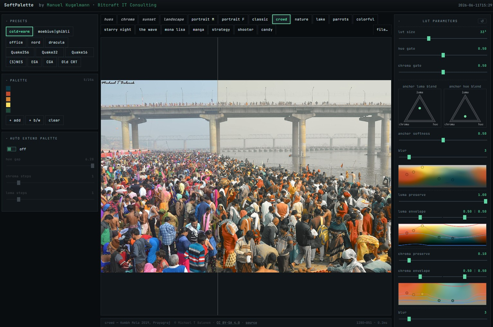

# SoftPalette
Map any image into a palette you choose. SoftPalette turns a handful of hex
colors into a smooth color grade — anchored to your palette where the image
hits a palette hue, blending continuously between them everywhere else.

## Try it
- <https://manuelkugelmann.github.io/SoftPalette/>
- githack (HEAD): <https://raw.githack.com/ManuelKugelmann/SoftPalette/main/index.html>

## Usage
- Drop an image (or paste with Ctrl+V, or click to browse) — or pick a built-in
  test image (including the hue and chroma ramps).
- Pick a palette: a preset, extract from the image, or hand-roll hex colors
  (up to 256).
- The grade applies live to the canvas. Drag anywhere on it to scrub a
  before / after split.

## Use cases
- Stylize photos to a game / film palette (Quake, Moebius|Ghibli, Old CRT, …).
- Map a moodboard's palette onto reference photos.
- A consistent look across many images from one palette.
- Explore how a palette feels in continuous tone.

## How it works (short version)
SoftPalette builds a 3D LUT in OkLab — one cell per (luma, a, b) — and maps the
image through it on the GPU. One method: a soft 3D Voronoi via Shepard IDW —
each cell is a distance-weighted blend of the palette anchors, kept vivid where
anchors agree on a hue and easing toward grey where they don't. Shared late
stages follow: anchor stamp → blur → reach desaturation → closing stamp. The
LUT is sampled per-pixel with hardware trilinear filtering, gamut-mapped, and
converted back to sRGB.

## Controls
The LUT params card runs top → bottom in pipeline order.

**Global**

| Control | What it does |
|---|---|
| lut size | 17³ → 257³ cube. Higher = more precise, slightly slower |
| hue gate | Opposing-hue safety net — curbs confidently-wrong hues |
| chroma gate | Near-grey desaturation. 1 = keep chroma, 0 = full desat |

**Step 1 — interpolate anchors.** Two draggable **L/C/H triangles** set how the
anchor blend weights luma vs chroma vs hue:

| Control | What it does |
|---|---|
| luma blend (triangle) | which anchors drive each cell's **luma** |
| hue blend (triangle) | which drive its **colour** (chroma + hue). Pull the two pins apart to decouple luma from colour |
| anchor softness | blend sharpness (low = mushy, high = near-Voronoi) |

**Step 2 — restore image tone, bounded by the palette envelope.** Per channel
(luma, chroma), each with a live preview strip (hue × that channel):

| Control | What it does |
|---|---|
| luma / chroma preserve | keep image structure (1) or snap to palette values (0) |
| luma / chroma envelope | dual-thumb limit on how far output may leave the palette's per-hue range (1 = no limit, 0 = clamp at the band) |

**Step 3 — effects.**

| Control | What it does |
|---|---|
| blur | post-build smoothing iterations |
| reach | distance beyond which far-out colors desaturate instead of latching to a wrong hue |
| anchor stamp | closing stamp: 1 = exact palette colors, 0 = blended into the surround |
| lut blend | mix the result with the original (100 % = full effect) |

**extend palette** (toggle) auto-fills each anchor with a constellation of
luma / chroma / hue variants. **Debug**: per-stage LUT view, envelope overlays
(blue floor / red ceil), and the chroma-ramp test image.
